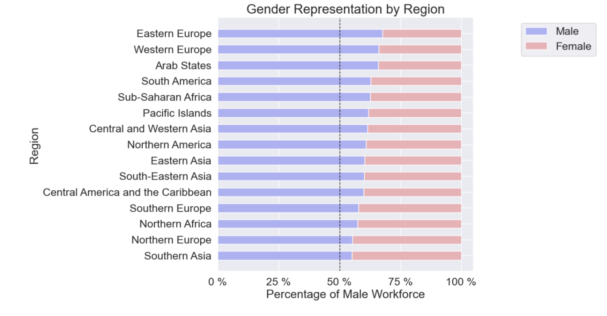
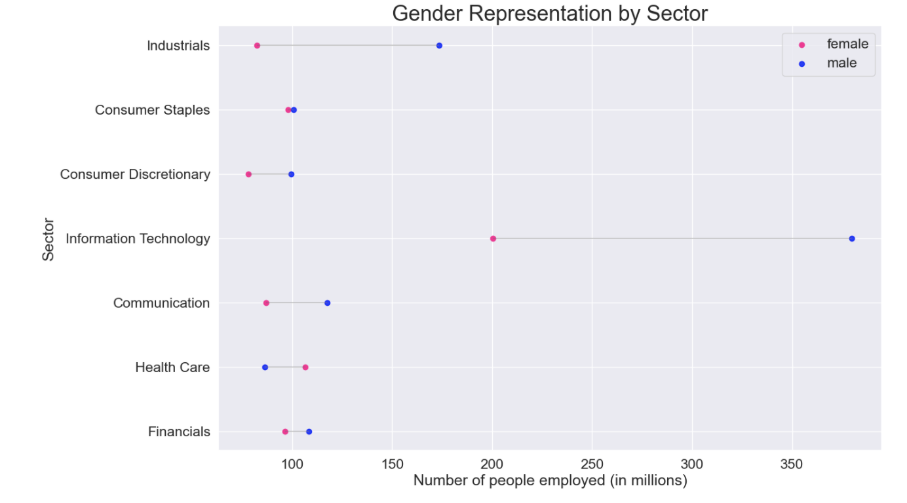
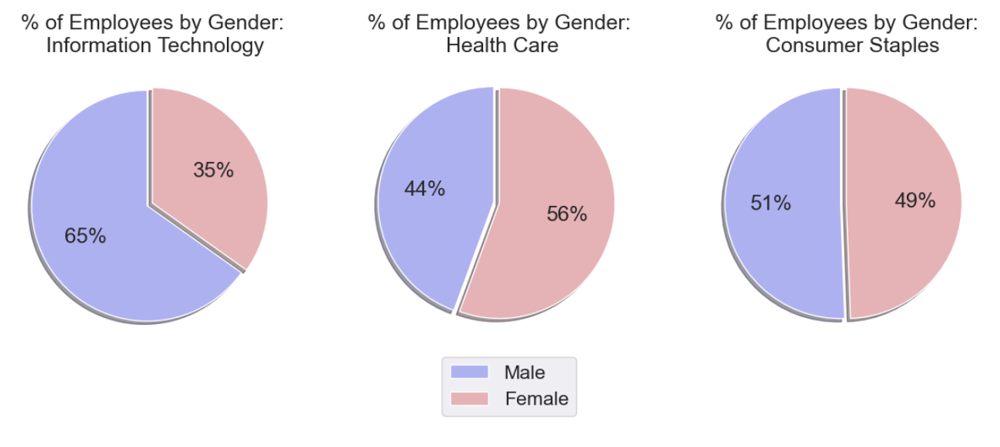

# Exploring Gender Gap

I explore the different facets of how the gender gap represents itself using data that has information on companies from different industries and regions (inflow, outflow, job category, year joined)

The facets I explore include:

  1. <b>Employment</b>: We examine the number of people employed by summing up the count column and differentiating by gender. We examine data from 2012-2019. This section looks at the data regardless of region, compnay and sector. From this, we see a trend that the number of employees increased over time for both the male and female gender, however, there is a clear gap between the genders from the given data.
  
  

  
  
  2. <b>Region</b>: We can see from the following visualization that employement in general seems to be greater in Northern America followed by Southern Asia. From all regions, we see the gender gap in employement, with the male population leading.
  
 
  3. <b>Sector</b>: The gender makeup of the workforce is examined by sector in this section. In all industries except the health care sector, it showed that the number of people employed in that particular industry was mostly male.
  
  
 
  

